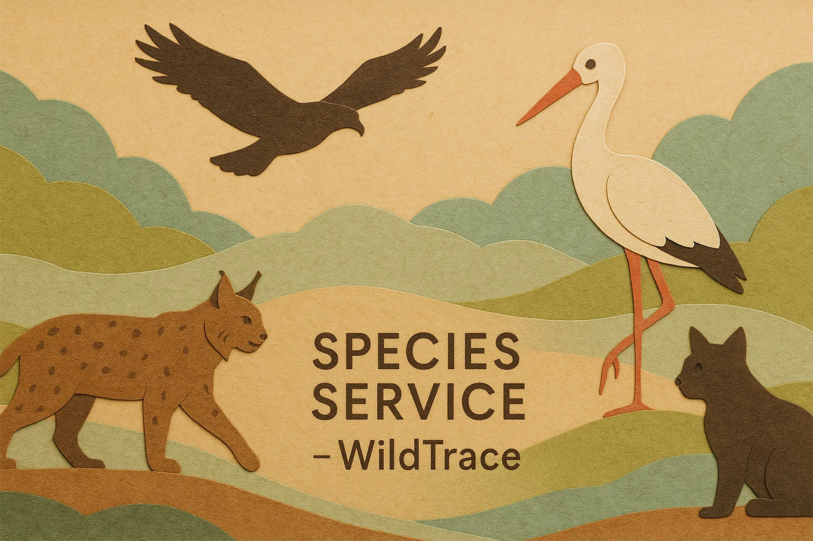

<div style="text-align: center;">
  
</div>

# WildTrace – Species Service

## Descripción del microservicio

Este microservicio forma parte de **WildTrace**, un sistema distribuido basado en microservicios para registrar avistamientos de fauna en zonas naturalizadas.

`species-service` gestiona el catálogo de especies que pueden observarse. Ofrece operaciones CRUD completas y expone información tanto común como científica, incluyendo el nivel de conservación.

El servicio permite:
- Crear, actualizar, eliminar y consultar especies
- Documentación completa con Swagger/OpenAPI
- Validaciones con `@Valid` y control de errores personalizado

---


### Entidad principal: `Species`

```text
Species
 ├── Long speciesId
 ├── String commonName
 ├── String scientificName
 ├── String conservationStatus
```

Además, se utilizan dos DTOs:

```text
SpeciesRequestDTO
 ├── String commonName
 ├── String scientificName
 ├── String conservationStatus

SpeciesResponseDTO
 ├── Long speciesId
 ├── String commonName
 ├── String scientificName
 ├── String conservationStatus
```

---

## Setup local (instalación)

1. **Clonar el repositorio del microservicio:**
```bash
git clone https://github.com/dsuarezg/WildTrace.git
cd WildTrace/species-service
```

2. **Crear base de datos en MySQL:**
```sql
CREATE DATABASE wildtrace_species;
```

3. **Configurar `application.properties`:**
```properties
spring.application.name=species-service

spring.datasource.url=jdbc:mysql://localhost:3306/wildtrace_species
spring.datasource.username=username
spring.datasource.password=password
spring.datasource.driver-class-name=com.mysql.cj.jdbc.Driver

spring.jpa.hibernate.ddl-auto=update
spring.jpa.show-sql=true
server.port=8081
```

4. **Construir y ejecutar el microservicio:**
```bash
mvn clean install
mvn spring-boot:run
```

5. **Swagger UI:**
```
http://localhost:8081/swagger-ui/index.html
```

---

## Tecnologías utilizadas

- Java 21
- Spring Boot 3.4.6
- Spring Data JPA
- MySQL / MariaDB
- Maven
- Swagger / OpenAPI 3
- JUnit 5
- Mockito
- MockMvc
- ArchUnit
- JaCoCo
- Lombok

---

## Cobertura de tests

Se utiliza JaCoCo para calcular cobertura:
```bash
mvn clean verify
```
Informe disponible en:
```
species-service/target/site/jacoco/index.html
```

- 100% cobertura de `SpeciesService`
- 100% cobertura de `SpeciesController`
- Casos positivos y negativos cubiertos (404, validaciones, etc.)

| GROUP            | PACKAGE                                   | CLASS                                   | INSTR_MISSED | INSTR_COVERED | % INSTR | LINE_MISSED | LINE_COVERED | % LINE | METHOD_MISSED | METHOD_COVERED | % METHOD |
|------------------|-------------------------------------------|-----------------------------------------|--------------|---------------|---------|-------------|--------------|--------|---------------|----------------|----------|
| species-service  | org.ironhack.speciesService               | SpeciesServiceApplication               | 5            | 3             | 37.5%   | 2           | 1            | 33.3%  | 1             | 1              | 50.0%    |
| species-service  | org.ironhack.speciesService.controller    | SpeciesController                       | 0            | 42            | 100.0%  | 0           | 8            | 100.0% | 0             | 7              | 100.0%   |
| species-service  | org.ironhack.speciesService.service       | SpeciesService                          | 0            | 93            | 100.0%  | 0           | 21           | 100.0% | 0             | 9              | 100.0%   |
| species-service  | org.ironhack.speciesService.exception     | SpeciesNotFoundException                | 4            | 5             | 55.6%   | 2           | 2            | 50.0%  | 1             | 1              | 50.0%    |
| species-service  | org.ironhack.speciesService.config        | OpenApiConfig                           | 0            | 8             | 100.0%  | 0           | 2            | 100.0% | 0             | 2              | 100.0%   |
| species-service  | org.ironhack.speciesService.config        | OpenApiConfig.new WebMvcConfigurer() {...} | 0         | 22            | 100.0%  | 0           | 5            | 100.0% | 0             | 2              | 100.0%   |
| species-service  | org.ironhack.speciesService.mapper        | SpeciesMapper                           | 3            | 40            | 93.0%   | 1           | 11           | 91.7%  | 1             | 2              | 66.7%    |
| **Total**        |                                           |                                         | **12**       | **213**       | **94.7%** | **5**      | **50**       | **90.9%** | **3**        | **24**         | **88.9%** |

---

## Endpoints REST principales

| Método | Endpoint                | Descripción                      |
|--------|-------------------------|----------------------------------|
| GET    | `/api/species`         | Listar todas las especies        |
| GET    | `/api/species/{id}`    | Consultar especie por ID         |
| POST   | `/api/species`         | Crear nueva especie              |
| PUT    | `/api/species/{id}`    | Actualizar especie existente     |
| DELETE | `/api/species/{id}`    | Eliminar especie por ID          |

---

## Buenas prácticas aplicadas

- Control de errores con `SpeciesNotFoundException` y `GlobalExceptionHandler`
- Validación de entrada con `@Valid` y DTOs
- Uso de `Mapper` para desacoplar lógica de conversión
- Tests FIRST: rápidos, independientes, auto-validables
- Arquitectura en capas validada con ArchUnit
- Preparado para ser consumido por otros microservicios vía Feign

---

## Mejoras futuras

- [ ] Cachear especies más consultadas
- [ ] Integrar niveles de protección oficiales (UICN)
- [ ] Sincronización con base de datos externa de especies

---

Desarrollado con ❤️ para **WildTrace**